# VPC_Terraform_Deployment

Creating VPC using Terraform & Deploy via GitHub Actions.

## Project Architecture
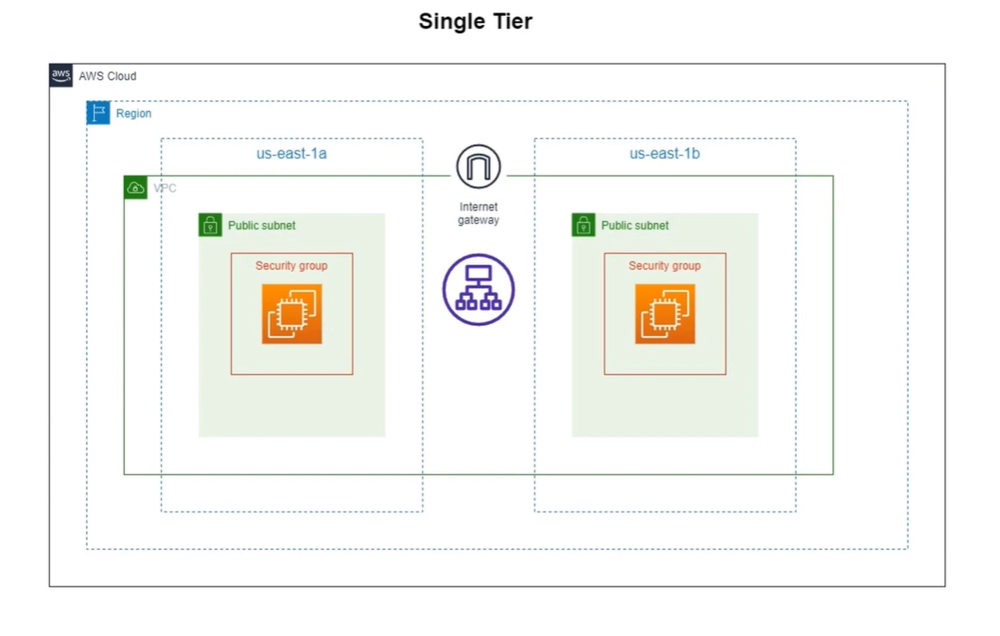

## Project Workflow
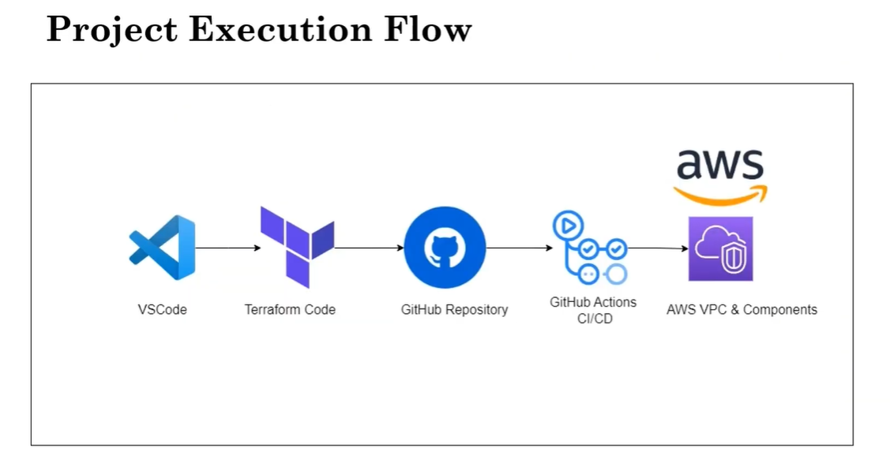

## Tools Used

<a href="https://code.visualstudio.com/">
  
</a>
<a href="https://aws.amazon.com">
  
</a>
<a href="https://www.kernel.org">
  
</a>
<a href="https://git-scm.com">
  
</a>
<a href="https://github.com">
  
</a>
<a href="https://icon.icepanel.io/AWS/svg/Compute/EC2.svg">
  
</a>
<a href="https://icon.icepanel.io/AWS/svg/Security-Identity-Compliance/IAM-Identity-Center.svg">
  
</a>
<a href="https://icon.icepanel.io/AWS/svg/Networking-Content-Delivery/Virtual-Private-Cloud.svg">
  
</a>
<a href="https://icon.icepanel.io/AWS/svg/Networking-Content-Delivery/Elastic-Load-Balancing.svg">
  
</a>

---

## Clone Repository
```bash
git clone https://github.com/Gaurav1517/VPC_Terraform_Deployment.git
cd VPC_Terraform_Deployment
```

## Create a New Branch
```bash
git checkout -b feature
```

## Check Current Branch
```bash
git branch
```

## Install AWS CLI in Windows
Refer to the [AWS CLI Installation Guide](https://docs.aws.amazon.com/cli/latest/userguide/getting-started-install.html).

### Download and Run the AWS CLI MSI Installer for Windows (64-bit):
[Download AWS CLI](https://awscli.amazonaws.com/AWSCLIV2.msi)

### Verify Installation:
```bash
aws --version
```

## Create an IAM User in AWS Console
1. **Username**: Choose a unique username for the IAM user.
2. **Permissions**: Grant Programmatic Access.
3. **Create Access Key**: Generate an Access Key and Secret Key.
4. **Download CSV File**: Save the credentials securely for future use.

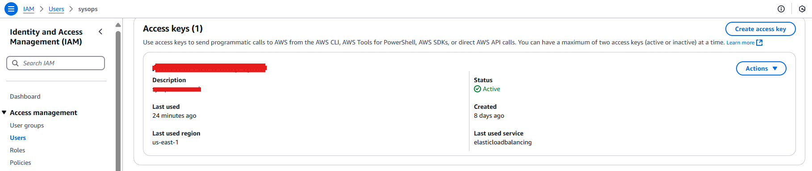

## Configure AWS CLI Credentials
Use the following command to configure AWS CLI with a specific user profile:
```bash
aws configure --profile <profile_name>
```
Provide:
- **Access Key**
- **Secret Key**
- **AWS Region**
- **Output Format**

### Example:
```bash
aws configure --profile my-aws-profile
```

## Verify AWS CLI Configuration
To confirm the credentials and configuration for the specified profile:
```bash
aws configure list --profile <profile_name>
```
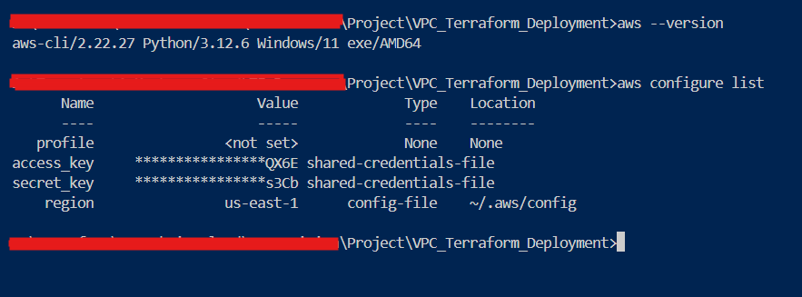

# Create S3 bucket for backend 
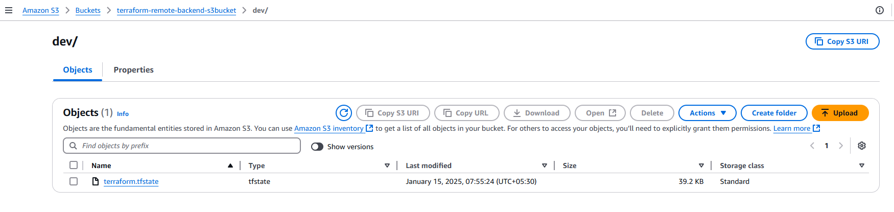

## Terraform Modules

### VPC Module
Handles the creation of the Virtual Private Cloud (VPC) with its associated subnets.

Files:
- `main.tf`: Contains the main configuration for VPC creation.
- `variables.tf`: Defines input variables.
- `output.tf`: Outputs the VPC details.
- `data.tf`: Retrieves existing AWS resources if required.

### Security Group (SG) Module
Defines the security group configurations for controlling inbound and outbound traffic.

Files:
- `main.tf`: Configures security groups.
- `variables.tf`: Defines input variables.
- `output.tf`: Outputs security group IDs.

### EC2 Module
Provisions EC2 instances within the specified subnets.

Files:
- `main.tf`: Configures the EC2 instances.
- `data.tf`: Fetches necessary data for instances.
- `variables.tf`: Defines input variables.
- `output.tf`: Outputs instance details.

### Application Load Balancer (ALB) Module
Configures the Application Load Balancer and integrates it with target groups.

Files:
- `main.tf`: Sets up the ALB and target group attachments.
- `variables.tf`: Defines input variables for ALB.
- `output.tf`: Outputs ALB details.

## CI/CD Pipeline with GitHub Actions
Automates the deployment of Terraform infrastructure.

### Workflow File: `.github/workflows/deploy.yml`
Steps:
1. **Checkout Repository**: Uses `actions/checkout` to fetch code.
2. **Set Up Terraform**: Uses `hashicorp/setup-terraform` action.
3. **Initialize Terraform**: Runs `terraform init`.
4. **Validate Terraform Configuration**: Runs `terraform validate`.
5. **Plan Terraform Changes**: Runs `terraform plan`.
6. **Apply Terraform Changes**: Runs `terraform apply --auto-approve`.

Ensure AWS credentials are securely stored in GitHub secrets:
- `AWS_ACCESS_KEY`
- `AWS_SECRET_ACCESS_KEY`

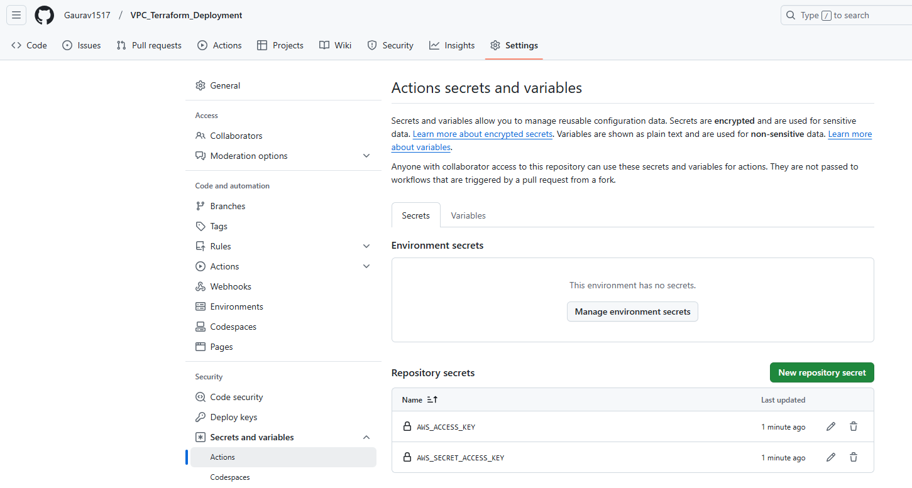

### Trigger
Workflow is triggered on every push to the `main` branch.

### Output Snap

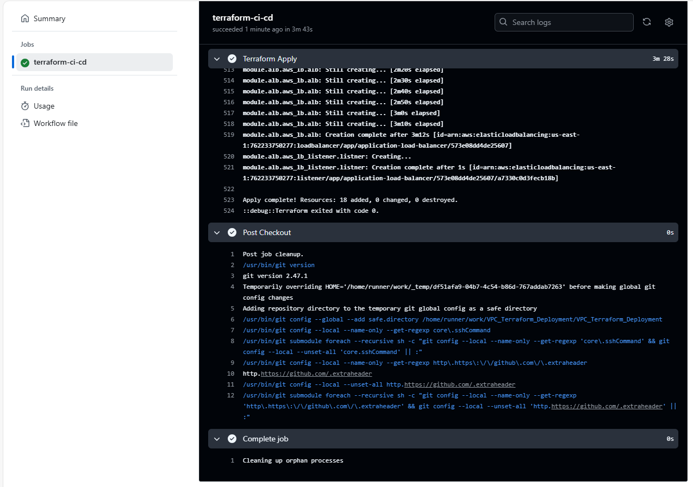

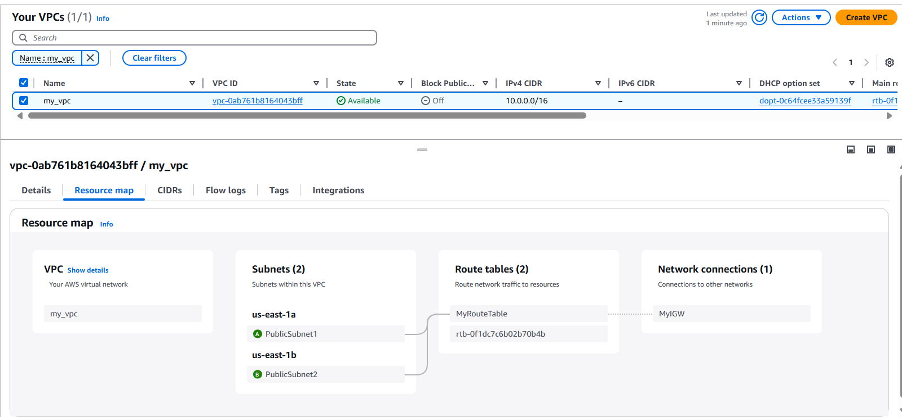
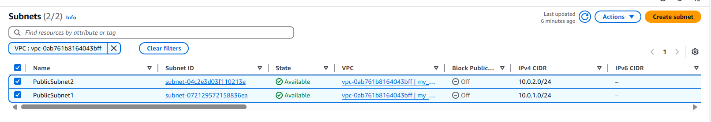
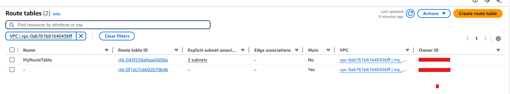
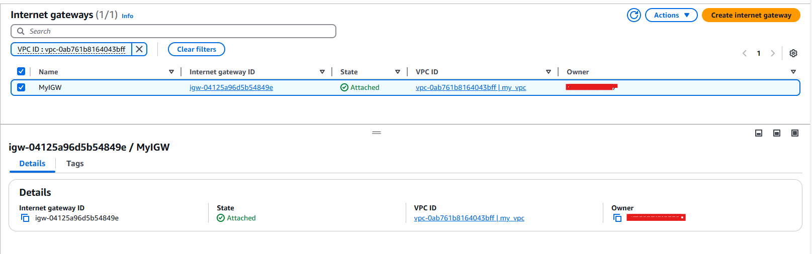
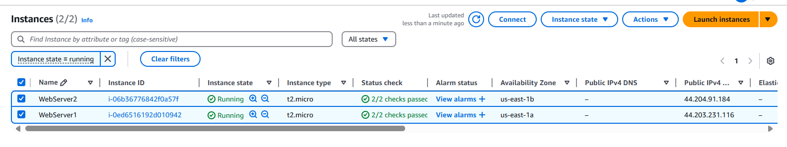
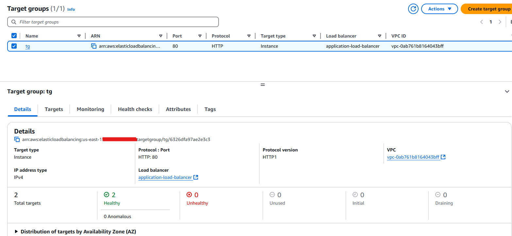
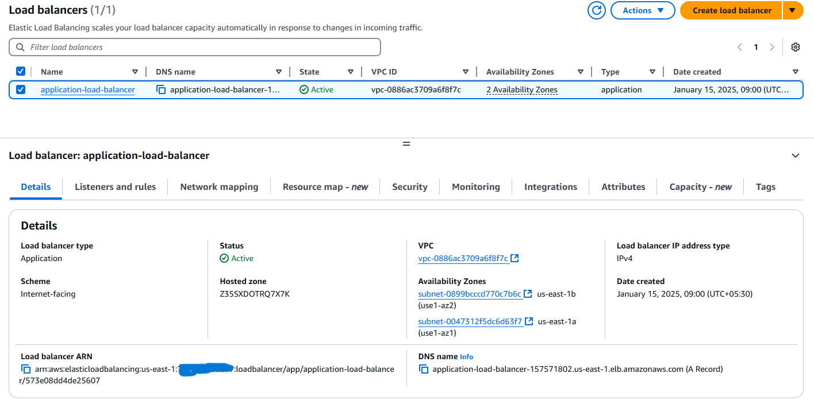
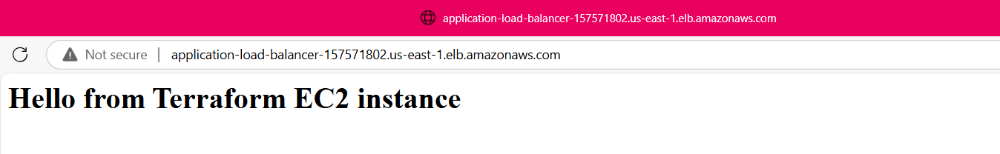


## Cleanup
To destroy the infrastructure, execute:
```bash
terraform destroy --auto-approve
```


